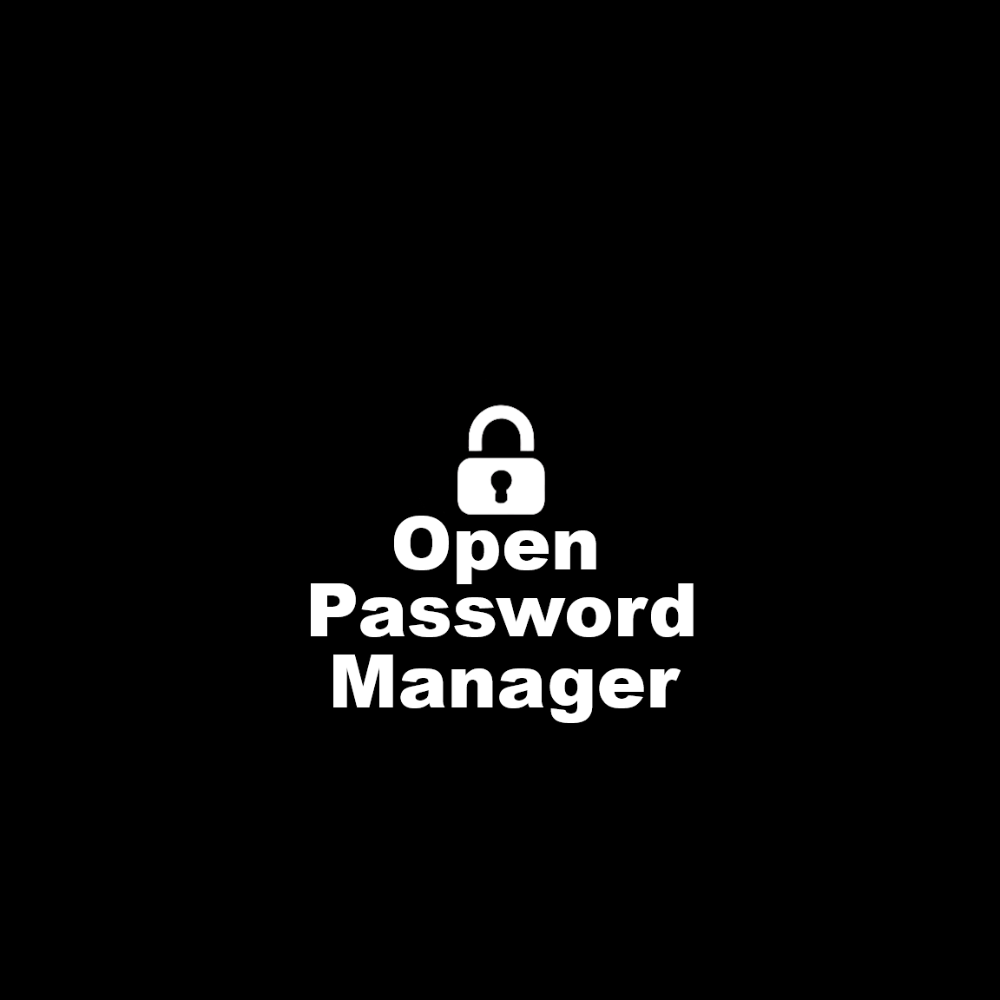

# Open Password Manager

Open Password Manager is an open source password manager with encrypted storage for various cloud providers, implemented as a cross-platform Flutter application.



## Features

- Passwords are encrypted in the database
- Works on iOS, Android, and the web
- Can be self-hosted on Firebase, Supabase, or Appwrite
- No password-related data leaves the device unencrypted
- Data is synched across all your devices
- Export function for local backups
- Open source and transparent

## Supported Backend Providers

- **[Firebase](https://firebase.google.com/)** - Google's comprehensive app development platform
- **[Supabase](https://supabase.com/)** - Open source Firebase alternative with PostgreSQL
- **[Appwrite](https://appwrite.io/)** - Self-hosted or cloud backend-as-a-service

## Quick Start

1. Choose your preferred backend provider
2. Follow the setup guide for your chosen provider:
   - [📖 Firebase Setup Guide](docs/setup-firebase.md)
   - [📖 Supabase Setup Guide](docs/setup-supabase.md)  
   - [📖 Appwrite Setup Guide](docs/setup-appwrite.md)
3. Create your `config.json` configuration file
4. Run the application: `flutter run`

## Cross-Platform Encryption

Open Password Manager uses a sophisticated encryption system that ensures your data is secure and accessible across all platforms:

- **Client-Side Encryption**: All data is encrypted on your device before being sent to the cloud
- **Shared Salt Management**: Encryption salts are stored in your backend to ensure compatibility across devices
- **Platform Independence**: Access your passwords seamlessly on web, mobile, and desktop
- **Secure Authentication**: Your login password is used for both authentication and encryption key derivation

### How It Works

1. **User Password**: You create a password for authentication and encryption/decryption
2. **Authentication**: Your password is used to authenticate with your chosen backend provider
3. **Key Derivation**: A unique encryption key is derived from your password using PBKDF2
4. **Salt Storage**: A unique salt is stored in your backend database for cross-platform consistency
5. **Data Encryption**: All password entries are encrypted with AES-256-GCM before storage
6. **Cross-Platform Access**: The same encrypted data can be decrypted on any platform you sign in from 

## Configuration

Each backend provider requires a specific configuration file. Create a `config.json` file in your project root with the appropriate configuration for your chosen provider.

### Configuration Examples

**Firebase:**
```json
{
    "provider": "firebase",
    "firebaseConfig": {
        "apiKey": "your-api-key",
        "authDomain": "your-project.firebaseapp.com",
        "projectId": "your-project-id",
        "storageBucket": "your-project.appspot.com",
        "messagingSenderId": "123456789",
        "appId": "1:123456789:web:abcdef",
        "measurementId": "G-XXXXXXXXXX",
        "passwordCollectionPrefix": "passwords",
        "saltCollectionName": "salts",
    }
}
```

**Supabase:**
```json
{
    "provider": "supabase",
    "supabaseConfig": {
        "url": "https://your-project.supabase.co",
        "anonKey": "your-anon-key",
        "passwordDbName": "your-password-table-name",
        "saltDbName": "your-salt-table-name"
    }
}
```

**Appwrite:**
```json
{
    "provider": "appwrite",
    "appwriteConfig": {
        "endpoint": "https://cloud.appwrite.io/v1",
        "project": "your-project-id",
        "databaseId": "opm-database",
        "passwordCollectionId": "your-collection-id",
        "saltCollectionId": "your-collection-id",
    }
}
```

For detailed setup instructions including database configuration, see the setup guides linked above.

## Security & Encryption

Open Password Manager implements multiple layers of security to protect your data:

### Encryption Details

- **Algorithm**: AES-256-GCM (Galois/Counter Mode)
- **Key Derivation**: PBKDF2 with 10,000 iterations
- **Salt Management**: Unique salts stored securely in your backend
- **Transport Security**: All data transmitted over HTTPS/TLS

### Cross-Platform Compatibility

The app uses a shared salt management system to ensure encrypted data works across all platforms:

1. **Shared Salt Storage**: Encryption salts are stored in your backend database
2. **Consistent Keys**: All platforms derive identical encryption keys from your master password
3. **Seamless Sync**: Sign in on any device to access your encrypted passwords
4. **No Lock-In**: Your data remains accessible regardless of the platform

### Security Architecture

- Your login password is used for **authentication and encryption key derivation**
- All encryption/decryption happens **client-side** before data transmission
- Backend providers store only **encrypted data and authentication credentials**
- Your stored passwords remain **unreadable without your login password**

### Password Recovery

**Important**: If you lose your login password, your data cannot be recovered. This is by design for maximum security.

- No backdoors or recovery mechanisms exist for encrypted data
- Export your passwords regularly as a backup
- Use a secure method to remember your login password

For technical implementation details, see `lib/shared/infrastructure/repositories/cryptography_repository_impl.dart`.

## Development

### Prerequisites

- [Flutter](https://flutter.dev/docs/get-started/install) (Latest stable version)
- A backend provider account (Firebase, Supabase, or Appwrite)

### Building the App

1. **Clone the repository**
   ```bash
   git clone https://github.com/xeladu/opm.git
   cd opm
   ```

2. **Install dependencies**
   ```bash
   flutter pub get
   ```

3. **Configure your backend** (see setup guides above)

4. **Run the app**
   ```bash
   # Web
   flutter run -d chrome
   
   # Android
   flutter run -d android
   
   # iOS  
   flutter run -d ios
   ```

### Project Structure

```
lib/
├── features/
│   ├── auth/           # Authentication logic
│   └── vault/          # Password storage logic
├── shared/
│   ├── domain/         # Domain entities and repositories
│   ├── infrastructure/ # Implementation details
│   └── utils/          # Utilities and configurations
└── main.dart           # Application entry point
```

### Architecture

This project follows **Domain-Driven Design (DDD)** principles:

- **Domain Layer**: Core business logic and entities
- **Infrastructure Layer**: External service implementations  
- **Presentation Layer**: UI components and state management

State management is handled with **[Riverpod](https://riverpod.dev/)** for type-safe dependency injection and reactive state.

## Contributing

You can contribute by

- suggesting new features
- filing bug reports
- work on existing tickets by creating a pull request

Thank you for your help!

## License

This project is licensed under the MIT License - see the [LICENSE](LICENSE) file for details.
